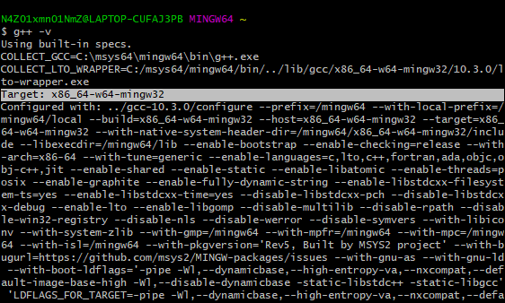

# Compiler Setup

## Install Windows Mingw

<iframe width="560" height="315" src="https://www.youtube-nocookie.com/embed/nMwQS40ePDw" title="YouTube video player" frameborder="0" allow="accelerometer; autoplay; clipboard-write; encrypted-media; gyroscope; picture-in-picture" allowfullscreen></iframe>

1. Install [MSYS2](https://www.msys2.org).

    - Download the installer: <a href="https://github.com/msys2/msys2-installer/releases/download/2021-07-25/msys2-x86_64-20210725.exe" class="button">msys2-x86_64-20210725.exe</a>
    - Run the installer.
    - Use the default installation folder or specify one.
        

2. Setting up MSYS2.

    - From the start menu run `MSYS2 MSYS`.
    - To update the package database and base package type the command `pacman -Syu` until `there is nothing todo`.

3. Install the toolchain

    - Type the command `pacman -S --needed base-devel mingw-w64-x86_64-toolchain`.
    - Press `ENTER` to select all package when the prompt `Enter a selection (default=all)` show up.

4. Validating installation
    - From the start menu run `MSYS2 MinGW 64-bit`.
    - Type the command `g++ -v`.
    - The command will show the target when installed.
        

## Install Linux GCC

1. Update the package-list.

    ```bash
    sudo apt-get update
    ```

2. Install GNU compiler tools and the GDB debugger.

    ```bash
    sudo apt-get install build-essential gdb
    ```

3. Optional install manual pages about using GNU/Linux

    ```bash
    sudo apt-get install manpages-dev
    ```

4. Validate installation

    ```bash
    make -v
    ```

    ```bash
    g++ -v
    gdb -v
    ```

## Install macOS GCC

1. Install [Homebrew](https://brew.sh) package manager.

    ```bash
    /bin/bash -c "$(curl -fsSL https://raw.githubusercontent.com/Homebrewinstall/HEAD/install.sh)"
    ```

2. Update Homebrew and validate brew instalation

    ```bash
    brew update
    brew upgrade
    ```

    ```bash
    brew --version
    ```

3. Install GCC and the GDB debugger via Homebrew

    ```bash
    brew info gcc
    brew install gcc
    brew install gdb
    ```

4. Removes previous application/dependency revisions saving considerable space.

    ```bash
    brew cleanup
    ```

5. Validate installation

    ```bash
    make -v
    ```

    ```bash
    g++ -v
    gdb -v
    ```
